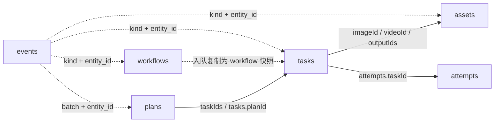

# SQLite 表设计

版本：第一版，`PRAGMA user_version = 1`。核对日期：2026-09-08。

素材删除补充：`assets.body.deletedAt` 为可选 UTC 时间，缺失表示可见。删除仅设置此字段并在同一事务写入事件；保留文件与历史任务引用。列表过滤已删除项，新任务拒绝使用已删除输入。详见 [素材删除与界面更新](素材删除与界面更新.md)。

本文描述当前实现。建表依据为 [store.ts](../backend/src/storage/store.ts)，内部字段依据为 [types.ts](../backend/src/media/types.ts)，事务行为依据为 [service.ts](../backend/src/media/service.ts)。Node 迁移保留 user_version=1 和旧版 JSON 字段。

## 1. 存储边界

数据库文件为 `<dataDir>/media.sqlite`，保存工作流、素材元数据、批次、任务、尝试与事件。媒体二进制放在 `<dataDir>/files`，数据库只保存相对路径。

源码安装默认使用项目 `.runtime/default`；发布包新安装默认使用用户目录 `~/.dsh-atelier/default`。显式配置 `dataDir` 时以配置为准。多个 profile 应使用不同数据目录和监听端口。

以下文件不属于数据库表：

| 文件 | 内容 |
| --- | --- |
| `config.json` | RunningHub 地址与密钥；不再保存固定并发上限 |
| `plugin.json` | Host 连接 URL 和托管/外部模式 |
| `service.lock` | 旧 Go 锁文件，保留用于迁移检查 |
| `node-service-lock.sqlite` | 新服务锁库，用独占事务保持运行权，不保存业务实体 |
| `files/*` | 受管输入和归档输出 |

RunningHub 密钥不写入业务表，Atelier API 当前不需要服务令牌；旧 `service.token` 不再读取或生成。`tasks.body.results` 可能包含平台签名结果地址，仅供后台恢复下载；公开任务投影隐藏该字段，日志和事件不能复制这些地址。

## 2. 物理结构与连接设置

采用五张 `id + body` 实体表和一张结构化事件表。实体以 JSON 保存，兼容旧 Go 数据，业务字段不是独立 SQL 列。

| 表名 | 每条记录代表 | 物理主键 |
| --- | --- | --- |
| `workflows` | 一份可编辑工作流定义 | `id` |
| `assets` | 一个已登记的受管媒体文件 | `id` |
| `plans` | 一批已入队任务及请求幂等信息 | `id` |
| `tasks` | 一个单段动作迁移任务的当前状态 | `id` |
| `attempts` | 一个任务某次尝试的最新快照 | `id` |
| `events` | 一次业务变化或会话通知 | `seq` |

连接设置：

```sql
PRAGMA journal_mode = WAL;
PRAGMA busy_timeout = 5000;
PRAGMA foreign_keys = ON;
```

Node 业务库使用一个 DatabaseSync 连接，写事务同步执行；独立锁库保持目录单进程独占。`foreign_keys = ON` 已开启，但当前 DDL 没有声明外键，实体关联仍由业务代码维护。

### 2.1 完整建表 SQL

以下是当前初始化 SQL 的格式化版本：

```sql
CREATE TABLE IF NOT EXISTS workflows (
    id TEXT PRIMARY KEY,
    body TEXT NOT NULL
);

CREATE TABLE IF NOT EXISTS assets (
    id TEXT PRIMARY KEY,
    body TEXT NOT NULL
);

CREATE TABLE IF NOT EXISTS plans (
    id TEXT PRIMARY KEY,
    body TEXT NOT NULL
);

CREATE TABLE IF NOT EXISTS tasks (
    id TEXT PRIMARY KEY,
    body TEXT NOT NULL
);

CREATE TABLE IF NOT EXISTS attempts (
    id TEXT PRIMARY KEY,
    body TEXT NOT NULL
);

CREATE TABLE IF NOT EXISTS events (
    seq INTEGER PRIMARY KEY AUTOINCREMENT,
    session_id TEXT NOT NULL,
    entity_id TEXT NOT NULL,
    kind TEXT NOT NULL,
    message TEXT NOT NULL,
    notify INTEGER NOT NULL,
    delivered INTEGER NOT NULL DEFAULT 0,
    created_at TEXT NOT NULL
);

CREATE INDEX IF NOT EXISTS event_notifications
    ON events(notify, delivered, seq);

CREATE INDEX IF NOT EXISTS task_state
    ON tasks(json_extract(body, '$.state'));

CREATE INDEX IF NOT EXISTS task_session
    ON tasks(json_extract(body, '$.sessionId'));

PRAGMA user_version = 1;
```

### 2.2 共同字段规则

| 字段 | SQL 类型 | 说明 |
| --- | --- | --- |
| `id` | TEXT PRIMARY KEY | 实体身份；业务层始终传入非空字符串 |
| `body` | TEXT NOT NULL | 完整实体 JSON，包括与外层一致的 `id` |

当前没有 `CHECK(json_valid(body))`、`CHECK(id = json_extract(body, '$.id'))`、状态枚举 CHECK 或 JSON 字段非空约束。JSON 合法性、内外 ID 一致和字段范围由业务写入路径保证。不能把直接修改 SQLite 等同于调用业务接口。

SQL 中的 `TEXT PRIMARY KEY` 没有显式声明 `NOT NULL`，这些表也不是 STRICT 或 WITHOUT ROWID 表；不要依赖它拒绝所有空主键情况。业务层负责生成有效 ID。

下文字段类型均指 JSON 类型。新增时间使用 UTC ISO 字符串，旧记录保留 Go RFC3339 格式，可能包含纳秒或时区偏移。应按时间解析，不能假设字符串固定长度。旧零时间可能为 `0001-01-01T00:00:00Z`。

## 3. workflows：工作流定义

| body 字段 | 类型 | 说明 |
| --- | --- | --- |
| `id` | string | 本地工作流 ID，预置为 `wan-animate2` |
| `name` | string | 展示名称 |
| `remoteId` | string | RunningHub 工作流 ID；长数字按字符串处理 |
| `revision` | integer | 定义修订号，用于保存时的版本比较 |
| `enabled` | boolean | 是否允许新任务使用 |
| `defaults` | object | 默认宽高、读取帧数和跳过帧数 |
| `mapping` | object | 业务字段到平台节点字段的映射 |
| `createdAt` | string | 创建时间 |
| `updatedAt` | string | 最近修改时间 |

`defaults` 和任务中的 `parameters` 使用相同结构：

| 子字段 | 类型 | 含义 |
| --- | --- | --- |
| `width` | integer | 输出宽度 |
| `height` | integer | 输出高度 |
| `frames` | integer | 读取帧数；0 表示全部读取 |
| `skip` | integer | 跳过帧数；0 表示不跳过 |

`mapping` 的每项包含 `nodeId: string` 和 `fieldName: string`。当前预置定义：

| mapping 键 | nodeId | fieldName |
| --- | --- | --- |
| `width` | `709` | `value` |
| `height` | `712` | `value` |
| `frames` | `746` | `value` |
| `skip` | `747` | `value` |
| `image` | `189` | `image` |
| `video` | `604` | `video` |

远端工作流为 `2096817694862565378`，正常默认参数为 480×848、frames=0、skip=0；验收任务显式使用 frames=81。固定 30 fps 不单独保存为可修改字段。

任务入队时复制完整工作流到 `tasks.body.workflow`。后续修改或删除定义不改变既有任务快照。当前初始化逻辑在预置 `wan-animate2` 记录缺失时重新创建它，因此删除预置定义后重启会恢复；需要持续停用时应设置 `enabled=false`。

## 4. assets：素材与结果文件

| body 字段 | 类型 | 说明 |
| --- | --- | --- |
| `id` | string | 受管素材 ID |
| `sessionId` | string | 来源 DSH 会话，供归属校验 |
| `name` | string | 文件展示名称，不作为定位依据 |
| `kind` | string | `image` 或 `video` |
| `mime` | string | 根据内容识别的 MIME 类型 |
| `size` | integer | 文件字节数 |
| `sha256` | string | 文件内容 SHA-256 十六进制摘要 |
| `path` | string | 相对 dataDir 的受管路径，例如 `files/asset-xxx.png` |
| `createdAt` | string | 登记时间 |

输入和输出共用一张表，没有独立的输入/输出角色列、视频时长、分辨率或解码结果字段。输入/输出用途由任务引用确定，不应根据文件名推断。`path` 属于内部字段，普通公开列表不返回它；可信 Host 的素材选择接口可取得受管路径。

身份生成方式：

| 来源 | ID 规则 |
| --- | --- |
| 普通上传或路径导入 | `asset-` + 16 字节随机数的十六进制字符串 |
| 有稳定来源 ID 的原生附件 | `asset-` + SHA-256(sessionId + NUL + sourceID) 的前 32 个十六进制字符 |
| 任务输出 | `output-<taskId>-<attempt>-<index>`，index 从 0 开始 |

同一内容的普通上传不会按 SHA-256 自动合并；哈希不是唯一索引。原生附件复用依靠来源身份。输出依靠任务、尝试、序号建立确定身份，不依赖可能过期的下载 URL。

## 5. plans：批次与幂等请求

表名保留 `plans`，但当前版本没有计划确认页面。这里保存素材齐全后已直接入队的批次。

| body 字段 | 类型 | 说明 |
| --- | --- | --- |
| `id` | string | 确定性批次 ID |
| `sessionId` | string | 来源会话 |
| `requestId` | string | 工具或客户端提供的稳定请求标识 |
| `fingerprint` | string | 请求任务清单 JSON 的 SHA-256 |
| `taskIds` | string[] | 本批次任务 ID，按请求顺序记录 |
| `createdAt` | string | 批次首次入队时间 |

批次 ID 为 `plan-` + SHA-256(sessionId + NUL + requestId) 的前 32 个十六进制字符。相同请求标识与相同指纹返回原批次；相同标识但任务清单不同则拒绝。数据库没有单独的 `(sessionId, requestId)` 唯一索引，这个约束通过确定性主键和事务内比较实现。

一批允许 1..100 个任务。完整参数与工作流快照放在 tasks 中，plans 不重复保存。批次没有单独的状态、确认版本或汇总计数列，汇总从关联任务计算。

## 6. tasks：当前执行状态

| body 字段 | 类型 | 说明 |
| --- | --- | --- |
| `id` | string | 随机本地任务 ID，前缀 `task-` |
| `planId` | string | 所属批次 |
| `sessionId` | string | 来源会话 |
| `title` | string | 用户可读任务名称 |
| `imageId` | string | 人物图素材 ID |
| `videoId` | string | 参考视频素材 ID |
| `workflow` | object | 入队时完整 Workflow 快照，含定义 revision |
| `parameters` | object | 本次实际参数快照 |
| `state` | string | 本地执行状态，见下表 |
| `remoteState` | string | 远端排队、运行或终态标识，未知时为空 |
| `remoteId` | string | 当前尝试的远端任务 ID，取得前为空 |
| `attempt` | integer | 当前生成尝试编号，从 1 开始；人工重试递增 |
| `revision` | integer | 本地任务修订号，从 1 开始；每次 Update 递增 |
| `cancelRequested` | boolean | 已持久化的取消意图，独立于执行状态 |
| `error` | string | 脱敏错误或等待说明 |
| `errorKind` | string | 错误分类，例如 capacity、network、business、download、submission_unknown |
| `failures` | integer | 调度暂缓/失败计数，用于退避；不是生成次数 |
| `nextRunAt` | string | 下次可推进时间 |
| `createdAt` | string | 首次入队时间 |
| `updatedAt` | string | 最近任务更新时刻 |
| `results` | object[]，可省略 | 远端结果清单；每项为 `url`、`outputType` |
| `uploads` | object，可省略 | 当前尝试已上传素材的文件名及所属账户，结构见下文 |
| `outputIds` | string[] | 当前尝试全部归档完成后的输出素材 ID，入队为空数组 |
| `accountHash` | string | 提交账户密钥摘要，仅内部使用；不保存密钥原文 |
| `providerUrl` | string | 提交时的平台地址，与账户摘要共同约束恢复查询 |

`results`、`uploads` 与 `accountHash` 从公开任务投影移除。结果下载中可能已经存在部分 assets 记录，但任务 `outputIds` 要等全部结果落地后才一次写入。当前没有独立的 results 表。

`uploads` 包含 `image`、`video`、`accountHash`、`providerUrl` 四个字符串字段：前两个是平台上传返回的 fileName，后两个用于防止换账户或平台后误用旧文件名。每个素材上传成功立即写入；旧记录缺少 uploads 时视为尚未上传。人工重试会清空此快照。此扩展位于 JSON body 内，不改变物理表或 schema 版本。

素材上传不受平台生成容量限制。完成上传后，任务以 queued 等待创建准入，并复用已保存的上传结果；一项上传失败或重启时只补传缺失项。上传成功但快照尚未提交就中断时可能重复上传，但不会重复生成。生成容量在每次创建前查询平台，不保存到 SQLite，也没有本地固定上限。

| state | 含义与恢复约束 |
| --- | --- |
| `queued` | 本地等待，平台满载仍可保留任务；有容量才提交 |
| `uploading` | 正在上传素材；重启后按取消意图取消或回到本地队列 |
| `submitting` | 已落盘提交意图；重启后转 submission_unknown |
| `submission_unknown` | 可能已经创建，但未取得 ID；停止自动执行，人工核对关联 ID |
| `remote_pending` | 已有远端 ID，只查询原任务 |
| `cancel_requested` | 远端取消尚待确认，不等于已取消 |
| `downloading` | 远端成功，正在保存结果；失败只恢复下载或刷新原任务结果链接 |
| `succeeded` | 所有预期结果已归档 |
| `failed` | 执行失败，允许对当前 revision 人工重试 |
| `cancelled` | 本地尚未提交即取消，或远端已确认取消 |

调度器把 succeeded、failed、cancelled、submission_unknown 都视为“停止自动执行”。其中 submission_unknown 并不是远端已结束，也不能自动重新提交。取消意图可能与迟到成功同时存在，最终可以是 `state=succeeded` 且 `cancelRequested=true`。

## 7. attempts：尝试快照

| body 字段 | 类型 | 说明 |
| --- | --- | --- |
| `id` | string | `<taskId>-<number>` |
| `taskId` | string | 所属任务 |
| `number` | integer | 对应 tasks.attempt |
| `remoteId` | string | 该次尝试已取得的远端任务 ID |
| `state` | string | 该次尝试最近一次写入的任务状态 |
| `error` | string | 该次尝试最近一次写入的脱敏错误 |
| `createdAt` | string | 当前实现首次写入时取任务 createdAt，后续保留 |
| `updatedAt` | string | 该尝试记录最近更新时间 |

这不是逐次 HTTP 请求日志。同一次尝试的记录持续 UPSERT，不会因查询、上传或下载重试新增行。Update 仅在新状态不是 queued、uploading 时写 attempts；单纯入队尚无尝试记录，本地直接取消也可能生成一条无远端 ID 的尝试记录。

人工重试失败任务时递增 tasks.attempt，保留此前 attempts 行。当前 `createdAt` 不能精确表示第二次及以后尝试的开始时间；若后续需要耗时统计，应新增真实尝试开始时间，而不是直接使用此字段。

## 8. events：增量事件与通知

| SQL 列 | 类型与约束 | API JSON 名 | 说明 |
| --- | --- | --- | --- |
| `seq` | INTEGER PRIMARY KEY AUTOINCREMENT | `seq` | 全局递增游标，不保证连续 |
| `session_id` | TEXT NOT NULL | `sessionId` | 来源会话；全局工作流事件使用空字符串 |
| `entity_id` | TEXT NOT NULL | `entityId` | task、asset、workflow 或 plan 的 ID |
| `kind` | TEXT NOT NULL | `kind` | 当前为 task、asset、workflow、batch |
| `message` | TEXT NOT NULL | `message` | 脱敏摘要，不是完整结构化变更内容 |
| `notify` | INTEGER NOT NULL | `notify` | 业务约定 0/1，API 返回 boolean |
| `delivered` | INTEGER NOT NULL DEFAULT 0 | `delivered` | 会话通知已确认持久化，业务约定 0/1 |
| `created_at` | TEXT NOT NULL | `createdAt` | UTC RFC3339Nano 时间 |

没有独立通知表或投递尝试日志，也没有投递时间、次数和错误字段。notify=0 的普通事件可以一直保持 delivered=0；这不代表待发送通知。

页面按 `seq > cursor ORDER BY seq LIMIT 200` 读取变化。会话投递器增加 `notify=1 AND delivered=0` 条件。两类消费者各自维护游标，页面读取不会修改 delivered。

任务每次 Update 都追加 task 事件，不仅状态枚举改变才记录。失败或未知提交的首次状态转换产生通知；批次全部任务停止自动执行后追加 batch 汇总。人工重试或核对后再次结束可能产生新的汇总事件，并非每批终身只允许一条。

投递器使用 `atelier-event-<seq>-<entityId>` 作为 DSH 消息 ID，在会话持久化成功后把 delivered 置 1。崩溃窗口通过会话日志中的稳定 ID 去重；数据库自身没有“消息已经注入 DSH”的跨系统事务。

## 9. 逻辑关联

下面是应用层关联，不代表已经声明 SQL 外键或级联删除：



DSH 会话不在本数据库中建表。各 sessionId 是外部会话标识；来源会话暂不可用时保留通知，不删除任务。一个素材可被多个任务复用。输出结果、素材和历史尝试当前没有级联清理机制。

## 10. 关键事务与恢复

| 操作 | 同一个 SQLite 事务中的内容 | 事务之外的内容 |
| --- | --- | --- |
| 批量入队 Admit | 幂等检查、读取并校验工作流和素材、全部任务、任务事件、批次 | 提交后唤醒调度器 |
| 任务 Update | 读取最新任务、修改字段、revision+1、任务 UPSERT、适用时尝试 UPSERT、事件与必要的批次汇总 | 上传、创建、查询、取消、下载等网络操作 |
| 保存工作流 | 版本检查、定义 UPSERT、workflow 事件 | 无远端提交 |
| 删除工作流 | 删除定义、workflow 事件 | 已入队快照保留 |
| 归档素材 | assets UPSERT、asset 事件 | 先复制临时文件、校验、原子改名 |
| 通知 ack | 单条 UPDATE delivered=1 | 先完成 DSH 会话持久化 |

事务复用唯一 DatabaseSync 连接，禁止嵌套事务和返回 Promise。网络与文件操作在事务外执行，返回后重新读取最新任务，保留并发取消意图。

付费创建前先写 submitting，再发远端请求；未取得远端 ID 的中断保守归为未知提交。已知 ID 的任务恢复时查询原 ID。人工重试只允许 state=failed 且 revision 匹配，增加 attempt 并清空当前执行字段。

文件系统与 SQLite 无法组成一个原子事务。临时文件校验后先改名，再登记记录；中间崩溃时依靠稳定输出身份重新归档。启动仅清理 `.incoming-*` 临时普通文件，保留已改名结果。已登记素材复用时校验文件存在、类型为普通文件且大小一致，当前不重新计算完整哈希。

## 11. 索引、查询与维护

### 11.1 索引使用范围

主键支持单实体查询。`event_notifications` 对通知筛选有效；task_state 和 task_session 已创建，但当前列表和调度仍读取全部任务并在内存筛选，不能据此宣称已实现索引分页。

当前没有 nextRunAt、planId、attempts.taskId 或素材 sessionId 的独立索引。任务量显著增长后，应把实际查询改为 SQL 条件分页并按查询形态补索引；若改为独立业务列，则应通过新 schema 版本迁移。

### 11.2 只读排查示例

以下 SQL 不包含密钥、结果 URL 或账户摘要，可在只读数据库连接中执行。`:session_id`、`:task_id` 和 `:cursor` 由客户端绑定参数。

```sql
-- 表与显式索引定义。
SELECT type, name, sql
FROM sqlite_schema
WHERE name NOT LIKE 'sqlite_%'
ORDER BY type, name;

-- 各任务状态数量。
SELECT json_extract(body, '$.state') AS state, COUNT(*) AS count
FROM tasks
GROUP BY json_extract(body, '$.state');

-- 指定会话的任务摘要，不直接导出整个 body。
SELECT id,
       json_extract(body, '$.title') AS title,
       json_extract(body, '$.state') AS state,
       json_extract(body, '$.remoteId') AS remote_id
FROM tasks
WHERE json_extract(body, '$.sessionId') = :session_id;

-- 某任务的尝试快照。
SELECT id,
       json_extract(body, '$.number') AS attempt,
       json_extract(body, '$.state') AS state,
       json_extract(body, '$.remoteId') AS remote_id
FROM attempts
WHERE json_extract(body, '$.taskId') = :task_id
ORDER BY json_extract(body, '$.number');

-- 待确认投递的会话通知。
SELECT seq, session_id, entity_id, kind, message
FROM events
WHERE seq > :cursor AND notify = 1 AND delivered = 0
ORDER BY seq
LIMIT 200;
```

### 11.3 版本与备份

初始化执行 `CREATE ... IF NOT EXISTS` 并设置 user_version=1；数据库版本大于 1 时拒绝启动。目前没有按版本逐级迁移的框架，`IF NOT EXISTS` 不会修复已有表的结构差异。

最简单的一致备份方式是停止对应服务，待退出后复制整个 dataDir，保留数据库、素材及受限配置。WAL 运行期间不能只复制 `media.sqlite` 并假设包含全部已提交事务；在线备份应使用 SQLite 备份机制并保证素材一致性。当前没有在线备份界面。

当前没有自动清理任务、尝试或事件的保留策略。不要直接删除 events、重置 seq 或修改任务状态来“重试”，否则可能破坏游标、通知去重和防重复生成约束；任务操作应走业务 API。
