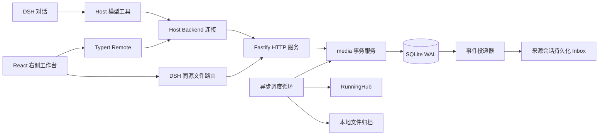

# 模块与运行逻辑

后端已迁移为独立 TypeScript / Node 服务。Ant Design 页面分层、主题与回合级 Skill 保持不变，普通对话不全局携带 Atelier 业务工具。

## 数据与调用关系

后端是任务状态的唯一权威来源。页面不保存任务状态机，Host 不执行平台重试，聊天上下文只保留引用与摘要。关闭浏览器或结束模型回合不会取消生成。

## 后端模块

`backend/src/main.ts` 解析参数，先核验旧 Go 已停止，再打开数据库、清理临时文件、启动 Fastify 与异步调度。停机通过 AbortController 中断网络，关闭 HTTP 并等待调度器退出，最后关闭数据库。HTTP 请求有十五秒收尾期限。托管模式用专属 stdin EOF；外部模式支持信号与 `/shutdown`。

`storage` 使用 Node 内置 `node:sqlite`。独立锁库以 `BEGIN EXCLUSIVE` 保持目录独占权，业务库保持 WAL。同步事务内禁止返回 Promise，网络和文件操作在事务外执行。任务、事件与尝试一起提交。旧 Go 的文件锁只用于迁移检查，不能与新实现同时运行。

第一版业务实体存于 JSON 列，表名使用内部白名单，SQL 参数均绑定。`tasks` 的状态和会话字段建 JSON 索引。当前列表查询在内存筛选分页，适合单用户中小规模任务历史；十万级历史应改为 SQL 条件分页，不增加另一套缓存数据库。

`media` 校验业务参数、会话归属和工作流修订版本。`Admit` 用 `sessionId + requestId` 计算稳定批次身份，对任务输入计算指纹。相同标识与输入返回原批次，输入不一致拒绝复用；所有任务同事务写入，避免部分入队。

工作流、尺寸参数和素材引用在入队时冻结。删除或修改工作流不会改变已有任务。模型工具从执行上下文取得当前会话身份；管理页面可以查看全部会话并操作任务。本地 API 不做身份认证，会话归属检查是业务约束，不是独立的 API 认证机制。

`runninghub` 只封装协议，不重试创建。仅提交工作流 ID 和六个节点字段。磁盘 Blob 与 FormData 流式上传，JSON 响应限制 4 MiB。平台请求禁止重定向；错误只保存代码与分类。HTTP 上传入口支持 file 前后任意位置的 sessionId，并清理暂存文件。

`scheduler` 在独占进程内串行推进本地 I/O，远端生成不设本地固定并发上限。先上传并逐项保存平台 fileName，再在每次创建前查询平台账户容量，按 concurrentLimit 减 runningCount 和 queuedCount 计算剩余名额；不再重复扣减本地任务数。平台满载或明确竞争拒绝后约两秒重新调度，复用上传结果。平台状态查询与创建无法组成原子操作，其他客户端抢占或统计延迟导致的明确拒绝回到等待，响应不明确仍进入未知提交。上传、查询和下载的临时失败退避，遵守 Retry-After。上传快照绑定账户摘要与平台地址，换账户时不会复用其他账户的文件名。

## 状态恢复

| 状态 | 含义 | 重启行为 |
| --- | --- | --- |
| queued | 已入本地队列 | 容量可用后执行 |
| uploading | 正在上传受管输入 | 重新排队；复用已保存上传，只补传缺失项，不重复生成 |
| submitting | 已落盘创建意图 | 转为 submission_unknown |
| submission_unknown | 可能创建成功但没有 ID | 禁止自动重发，人工关联远端 ID |
| remote_pending | 有明确远端 ID | 仅查询原任务 |
| cancel_requested | 已记录取消意图 | 持续核对远端结果 |
| downloading | 远端成功，归档未完成 | 只恢复下载，不创建新任务 |
| succeeded / failed / cancelled | 已知终态 | 不自动生成 |

提交前先事务写入 `submitting` 与账户摘要，然后调用平台。超时、连接中断、成功响应损坏或缺少 taskId 都不能证明未受理，因此进入 `submission_unknown`。此任务不阻止批次其他任务继续执行。

取消先记录 `CancelRequested`。排队任务可直接取消；上传完成后再次读取最新取消意图，避免已取消仍提交。已有远端 ID 时先查询状态，再发送取消；平台接受取消请求不等于终态已取消。若查询返回成功，仍归档结果并保留取消意图。

人工重试仅允许失败任务的当前 revision，防止双击重试。每次人工重试增加 attempt，旧远端 ID 和错误保留在尝试历史。未知提交通过人工核对 ID 恢复查询，不开放一键盲目重发。

## 文件归档

输入复制到 `.runtime/<profile>/files`，不引用原文件作为长期依赖。文件使用内部随机 ID 命名，记录 SHA-256、大小、类型与相对路径。数据库不保存媒体二进制。

下载输出先写同目录临时文件，读取过程中检查长度与文件上限，再检查文件头并原子改名，最后登记素材与事件。输出 ID 由任务 ID、attempt、输出序号组成；改名后、事务前退出时，重试使用相同身份修复。已登记结果只有文件存在且大小一致才可复用。

启动时，在数据目录独占锁内清理 `.incoming-*` 临时普通文件；此时尚未启动 HTTP 或调度，不会删除活跃上传。已改名的归档文件不参与清理。下载遇到限流或临时错误时，使用指数退避与 `Retry-After` 中较大的等待时间；403/404 会恢复原远端 ID 的查询以刷新结果地址，保留原尝试和已有输出，不重新生成。

支持 PNG、JPEG、WebP、MP4、WebM，真实 Wan 输出还可能使用 QuickTime `qt` 品牌，即使平台标记为 mp4。此时按真实内容归档为 MOV，浏览器实测可播放。第一版不使用 ffprobe，不自动验证素材时长和完整解码能力。结果全数归档后任务才成为 succeeded。

## 插件与页面

Host `AtelierRemote` 暴露强类型字符串命令接口，业务 JSON 在 Node 校验。官方生成器输出 Host 与 Client 契约，Client 显式 `$mount`。公开字段由 OpenAPI 生成 TypeScript，构建检查一致性。

开发端把后端和依赖打包为 `lib/backend.mjs`，Host 用自身 Node 路径启动包内入口。安装包不包含构建脚本、原生程序或私有目录依赖。启动等待健康检查最多十五秒。进程记录绑定 PID、启动时间、Node 路径、入口与数据目录，只清理已确认孤立的 Node 实例。新安装使用用户数据目录，源码安装保留项目数据目录，显式配置优先。

同源 `/api/atelier.upload` 使用流式请求体；`/api/atelier.file` 的 GET/HEAD 使用空的缓冲请求体，同时响应仍流式转发。必须分开：当前 DSH 流式请求体桥接对 GET 无条件设置 body，会在构造 Request 时抛错。Range、Content-Range、Content-Length、Content-Type 和下载文件名透传。

详情列用优先级 -100 临时贡献插件内容。退出时释放注册，原生详情自动恢复。960px 以下撤销插件内容并关闭详情列；没有移动端全屏替代。标题栏采用图标入口，所有页面只在详情列内部切换。

素材选择复用 DSH `SessionInput.insertReference` 和自有引用序列化器，模型接收素材 ID 与名称。插入时读取最新 draftRev，以引用在 detect 投影中占一个字符的规则计算草稿尾部位置。只插入引用，不调用 setDraft 或 submit，因此保留原草稿与已有附件。

页面使用事件游标每两秒增量查询。查询串行执行，避免慢网络积压；收到变化后重取相关页面快照。会话和筛选变化增加请求代次，旧响应不能覆盖新状态。已打开的任务详情单独读取，即使任务状态变化使其离开当前筛选页，仍可更新；详情请求退出时失效，避免旧响应覆盖新选择。

## 会话通知

普通状态变化只刷新页面，不启动模型回合。业务失败、未知提交和批次结束产生持久化通知。投递器查找来源 Agent，不存在则保留事件；使用稳定消息 ID 注入 next-step Inbox，不唤醒空闲模型。

只有 `sessions.flush()` 确认持久化成功后，才调用后端 ack。若在 flush 后、ack 前退出，恢复器按稳定消息 ID 去重。持久化失败保留待投递事件，故障不改变任务结果。

## 第一版限制

仅 Wan Animate2 单段，支持多个单段组成批次；不自动拆段、拼接、评价结果，不提供其他模型。平台未给出明确单段帧数上限，因此只校验参数非负与尺寸范围；超长素材需要用户自行选择读取范围。前端列表和调度器当前读取完整任务表，未针对海量历史优化。

本地上传和下载仍串行执行，远端生成可并发。慢速文件传输会延后其他任务的查询与远端取消调用，但取消意图立即落库；需要更高吞吐和更低取消延迟时，应增加有界文件工作池，并继续保证提交准入串行。

原生聊天附件在消息发送并进入当前会话日志后，由 `atelier_asset_list` 自动同步；从 DSH 附件服务取得受管本机路径，结合会话与附件 ID 幂等导入。当前接入本机附件存储，不支持没有本机路径的远程附件提供者。
